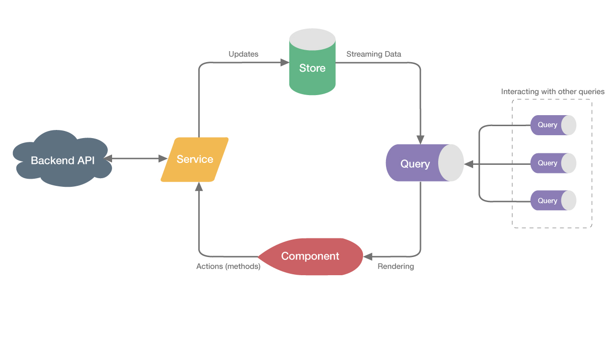

# where-to-learn-this

where to learn this

## react-devtools

- [所见即所得](https://react-devtools-tutorial.now.sh)
- [Introducing the React Profiler](https://reactjs.org/blog/2018/09/10/introducing-the-react-profiler.html#reading-performance-data)
- [Introducing the New React DevTools](https://reactjs.org/blog/2019/08/15/new-react-devtools.html)
- [React DevTools changelog](https://github.com/facebook/react/blob/master/packages/react-devtools/CHANGELOG.md#react-devtools-changelog)

## react-scripts

- [Alternatives to Ejecting](https://create-react-app.dev/docs/alternatives-to-ejecting)
- [Customizing create-react-app: How to Make Your Own Template](https://auth0.com/blog/how-to-configure-create-react-app/)

## State Management Architecture

### [Mobx](https://mobx.js.org/README.html)

### [Akita](https://netbasal.gitbook.io/akita/)

### [Flux](http://facebook.github.io/flux/docs/overview)

> 很容易看出共同点来，
>
> 1. 单向的数据流。
> 2. single source。
> 3. state 只能通过 action(或者叫别的名字)来改变。

## why react needs immutability

[Why is immutability so important (or needed) in JavaScript?](https://stackoverflow.com/questions/34385243/why-is-immutability-so-important-or-needed-in-javascript)

## [You Might Not Need Redux](https://medium.com/@dan_abramov/you-might-not-need-redux-be46360cf367)

## 函数式编程（functional programming）

1. [wiki](https://zh.wikipedia.org/wiki/%E5%87%BD%E6%95%B0%E5%BC%8F%E7%BC%96%E7%A8%8B)
2. [Master the JavaScript Interview: What is Functional Programming?](https://medium.com/javascript-scene/master-the-javascript-interview-what-is-functional-programming-7f218c68b3a0)
3. [函数式编程初探](http://www.ruanyifeng.com/blog/2012/04/functional_programming.html)

> 什么是函数式编程？
>
> 回答这个问题并不是那么容易。

## 面试

1. [如何面试程序员？](http://www.ruanyifeng.com/blog/2010/12/how_to_interview_a_programmer.html)

2. [面试时，如何向公司提问？](http://www.ruanyifeng.com/blog/2012/08/questions_you_need_to_ask_in_an_interview.html)

## Promise

1. [Promises/A+规范](https://www.ituring.com.cn/article/66566)
2. [Implementing](https://www.promisejs.org/)

## MicroTask

1. process.nextTick
2. Promises（这里指浏览器实现的原生 Promise）
3. Object.observe
4. MutationObserver

## MacroTask

1. script（整体代码
2. setTimeout
3. setInterval
4. setImmediate
5. I/O
6. UI rendering

## 性能监控，首屏时间

1. [10 分钟彻底搞懂前端页面性能监控](https://juejin.im/post/5d8cc378f265da5ba0776f36)
2. [如何进行 web 性能监控？](http://www.alloyteam.com/2020/01/14184/#prettyPhoto)
3. [Performance API](https://javascript.ruanyifeng.com/bom/performance.html)
4. [7 天打造前端性能监控系统](https://fex.baidu.com/blog/2014/05/build-performance-monitor-in-7-days/)
5. [关于首屏时间采集自动化的解决方案](https://cloud.tencent.com/developer/article/1061844)
6. [可交互时间的探索和首屏时间的改进之路](https://weex.apache.org/zh/blog/interaction-optimization.html)
7. [spa 项目如何计算首屏](http://www.uyi2.com/archiveDetail?id=5742&name=spa%E9%A1%B9%E7%9B%AE%E5%A6%82%E4%BD%95%E8%AE%A1%E7%AE%97%E9%A6%96%E5%B1%8F)
8. [如何计算首屏加载时间？](https://www.zhihu.com/question/23212408)
9. [精确并自动化地获取页面首屏时间](https://juejin.im/post/5a9d108351882555867ee3cf)

## mobx 源码

1. [Becoming fully reactive: an in-depth explanation of MobX](https://medium.com/hackernoon/becoming-fully-reactive-an-in-depth-explanation-of-mobservable-55995262a254#.xvbh6qd74)
2. [mobx v4](https://github.com/mobxjs/mobx/tree/5.15.4/src/v4)

## martinfowler articles

- [CQRS](https://martinfowler.com/bliki/CQRS.html)
- [CommandQuerySeparation](https://martinfowler.com/bliki/CommandQuerySeparation.html)
- [BoundedContext](https://martinfowler.com/bliki/BoundedContext.html)
- [Event Sourcing](https://martinfowler.com/eaaDev/EventSourcing.html)
