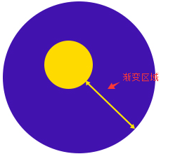
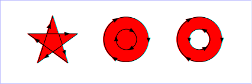
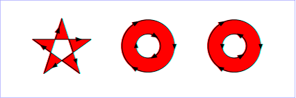
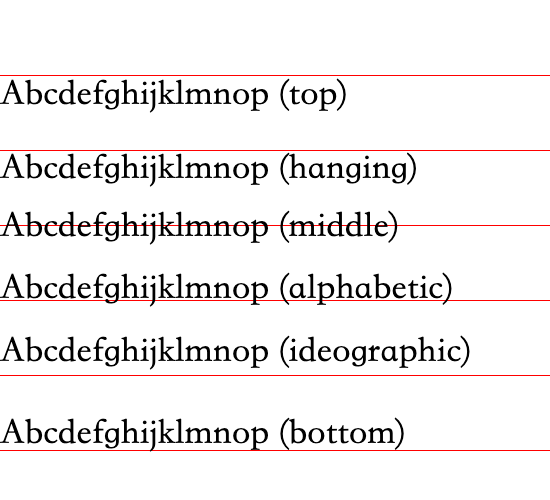

# canvas

[教程](https://developer.mozilla.org/zh-CN/docs/Web/API/Canvas_API/Tutorial)

## \<canvas\> 元素

```html
<!-- 只有两个可选属性 width和height -->
<canvas id="tutorial" width="150" height="150"></canvas>
```

> 当没有设置宽度和高度的时候，canvas 会初始化宽度为 300 像素和高度为 150 像素。该元素可以使用 CSS 来定义大小，但在绘制时图像会伸缩以适应它的框架尺寸：如果 CSS 的尺寸与初始画布的比例不一致，它会出现扭曲。

> 当开始时没有为 canvas 规定样式规则，其将会完全透明。

### 替换内容

> 这非常简单：我们只是在\<canvas>标签中提供了替换内容。不支持\<canvas>的浏览器将会忽略容器并在其中渲染后备内容。而支持\<canvas>的浏览器将会忽略在容器中包含的内容，并且只是正常渲染 canvas。

```html
<canvas id="stockGraph" width="150" height="150">
  current stock price: $3.15 +0.15
</canvas>

<canvas id="clock" width="150" height="150">
  
</canvas>
```

### \</canvas> 标签不可省

> 与 \ 元素不同，\<canvas> 元素需要结束标签(</canvas>)。如果结束标签不存在，则文档的其余部分会被认为是替代内容，将不会显示出来。

## 渲染上下文（The rendering context）

```js
// 在同一个canvas上以相同的 contextType 多次调用此方法只会返回同一个上下文。
var canvas = document.getElementById("tutorial");
var ctx = canvas.getContext("2d");
```

## 检查支持性

```js
var canvas = document.getElementById("tutorial");

if (canvas.getContext) {
  var ctx = canvas.getContext("2d");
  // drawing code here
} else {
  // canvas-unsupported code here
}
```

## 栅格


## 绘制矩形

> 不同于 SVG，\<canvas> 只支持两种形式的图形绘制：矩形和路径（由一系列点连成的线段）。所有其他类型的图形都是通过一条或者多条路径组合而成的。

```js
// 绘制一个填充的矩形
fillRect(x, y, width, height);
// 绘制一个矩形的边框
strokeRect(x, y, width, height);
// 清除指定矩形区域，让清除部分完全透明
clearRect(x, y, width, height);
```

## 绘制路径

```js
// 新建一条路径，生成之后，图形绘制命令被指向到路径上生成路径。
beginPath();
// 闭合路径之后图形绘制命令又重新指向到上下文中。
closePath();
// 通过线条来绘制图形轮廓。
stroke();
// 通过填充路径的内容区域生成实心的图形。
fill();
```

> closePath(),不是必需的。这个方法会通过绘制一条从当前点到开始点的直线来闭合图形。如果图形是已经闭合了的，即当前点为开始点，该函数什么也不做。

> 当你调用 fill()函数时，所有没有闭合的形状都会自动闭合，所以你不需要调用 closePath()函数。但是调用 stroke()时不会自动闭合。

### 移动笔触

```js
// 将笔触移动到指定的坐标x以及y上
moveTo(x, y);
```

### 线

```js
// 绘制一条从当前位置到指定x以及y位置的直线
lineTo(x, y);
```

### 圆弧

```js
// 画一个以（x,y）为圆心的以radius为半径的圆弧（圆），从startAngle开始到endAngle结束，按照anticlockwise给定的方向（默认为顺时针）来生成。
// 参数anticlockwise为一个布尔值。为true时，是逆时针方向，否则顺时针方向
// arc()函数中表示角的单位是弧度，不是角度。角度与弧度的js表达式:
// 弧度=(Math.PI/180)*角度
arc(x, y, radius, startAngle, endAngle, anticlockwise);
```

```js
// 根据给定的控制点和半径画一段圆弧，再以直线连接两个控制点。
arcTo(x1, y1, x2, y2, radius);
```

### 二次贝塞尔曲线及三次贝塞尔曲线

```js
// 绘制二次贝塞尔曲线，cp1x,cp1y为一个控制点，x,y为结束点
quadraticCurveTo(cp1x, cp1y, x, y);
```

```js
// 绘制三次贝塞尔曲线，cp1x,cp1y为控制点一，cp2x,cp2y为控制点二，x,y为结束点。
bezierCurveTo(cp1x, cp1y, cp2x, cp2y, x, y);
```

### 矩形

```js
// 绘制一个左上角坐标为（x,y），宽高为width以及height的矩形。
rect(x, y, width, height);
```

## Path2D 对象

> Path2D()会返回一个新初始化的 Path2D 对象（可能将某一个路径作为变量——创建一个它的副本，或者将一个包含 SVG path 数据的字符串作为变量）。

```js
new Path2D(); // 空的Path对象
new Path2D(path); // 克隆Path对象
new Path2D(d); // 从SVG建立Path对象
```

> 所有的路径方法比如 moveTo, rect, arc 或 quadraticCurveTo 等，如我们前面见过的，都可以在 Path2D 中使用。

> Path2D API 添加了 addPath 作为将 path 结合起来的方法。当你想要从几个元素中来创建对象时，这将会很实用。比如：

```js
// 添加了一条路径到当前路径（可能添加了一个变换矩阵）。
Path2D.addPath(path [, transform])
```

### Path2D 示例

```js
function draw() {
  var canvas = document.getElementById("canvas");
  if (canvas.getContext) {
    var ctx = canvas.getContext("2d");

    var rectangle = new Path2D();
    rectangle.rect(10, 10, 50, 50);

    var circle = new Path2D();
    circle.moveTo(125, 35);
    circle.arc(100, 35, 25, 0, 2 * Math.PI);

    ctx.stroke(rectangle);
    ctx.fill(circle);
  }
}
```

### 使用 SVG paths

> 新的 Path2D API 有另一个强大的特点，就是使用 SVG path data 来初始化 canvas 上的路径。这将使你获取路径时可以以 SVG 或 canvas 的方式来重用它们。

```js
var p = new Path2D("M10 10 h 80 v 80 h -80 Z");
```

## 色彩 Colors

```js
// 设置图形的填充颜色。
fillStyle = color;
// 设置图形轮廓的颜色。
strokeStyle = color;
```

> 注意: 一旦您设置了 strokeStyle 或者 fillStyle 的值，那么这个新值就会成为新绘制的图形的默认值。如果你要给每个图形上不同的颜色，你需要重新设置 fillStyle 或 strokeStyle 的值。

## 透明度 Transparency

```js
// 这个属性影响到 canvas 里所有图形的透明度，有效的值范围是 0.0 （完全透明）到 1.0（完全不透明），默认是 1.0。
globalAlpha = transparencyValue;
// 指定透明颜色，用于描边和填充样式
ctx.strokeStyle = "rgba(255,0,0,0.5)";
ctx.fillStyle = "rgba(255,0,0,0.5)";
```

## 线型 Line styles

```js
// 设置线条宽度。
lineWidth = value;
// 设置线条末端样式。
lineCap = type;
// 设定线条与线条间接合处的样式。
lineJoin = type;
// 限制当两条线相交时交接处最大长度；所谓交接处长度（斜接长度）是指线条交接处内角顶点到外角顶点的长度。
miterLimit = value;
// 返回一个包含当前虚线样式，长度为非负偶数的数组。
getLineDash();
// 设置当前虚线样式。
setLineDash(segments);
// 设置虚线样式的起始偏移量。
lineDashOffset = value;
```

### lineWidth

> 这个属性设置当前绘线的粗细。属性值必须为正数。默认值是 1.0。

> 线宽是指给定路径的中心到两边的粗细。换句话说就是在路径的两边各绘制线宽的一半。因为画布的坐标并不和像素直接对应，当需要获得精确的水平或垂直线的时候要特别注意。

> 想要获得精确的线条，必须对线条是如何描绘出来的有所理解。见下图，用网格来代表 canvas 的坐标格，每一格对应屏幕上一个像素点。在第一个图中，填充了 (2,1) 至 (5,5) 的矩形，整个区域的边界刚好落在像素边缘上，这样就可以得到的矩形有着清晰的边缘。
>   
> 如果你想要绘制一条从 (3,1) 到 (3,5)，宽度是 1.0 的线条，你会得到像第二幅图一样的结果。实际填充区域（深蓝色部分）仅仅延伸至路径两旁各一半像素。而这半个像素又会以近似的方式进行渲染，这意味着那些像素只是部分着色，结果就是以实际笔触颜色一半色调的颜色来填充整个区域（浅蓝和深蓝的部分）。这就是上例中为何宽度为 1.0 的线并不准确的原因。

> 要解决这个问题，你必须对路径施以更加精确的控制。已知粗 1.0 的线条会在路径两边各延伸半像素，那么像第三幅图那样绘制从 (3.5,1) 到 (3.5,5) 的线条，其边缘正好落在像素边界，填充出来就是准确的宽为 1.0 的线条。

> 对于那些宽度为偶数的线条，每一边的像素数都是整数，那么你想要其路径是落在像素点之间 (如那从 (3,1) 到 (3,5)) 而不是在像素点的中间。同样，注意到那个例子的垂直线条，其 Y 坐标刚好落在网格线上，如果不是的话，端点上同样会出现半渲染的像素点。

### lineCap

> 属性 lineCap 的值决定了线段端点显示的样子。它可以为下面的三种的其中之一：butt，round 和 square。默认是 butt。  
>   
> 最左边的线用了默认的 butt 。可以注意到它是与辅助线齐平的。中间的是 round 的效果，端点处加上了半径为一半线宽的半圆。右边的是 square 的效果，端点处加上了等宽且高度为一半线宽的方块。

### lineJoin

> lineJoin 的属性值决定了图形中两线段连接处所显示的样子。它可以是这三种之一：round, bevel 和 miter。默认是 miter。  
> 

#### miterLimit

> miterLimit 属性设置或返回最大斜接长度。  
> 斜接长度指的是在两条线交汇处内角和外角之间的距离  
>   
> 只有当 lineJoin 属性为 "miter" 时，miterLimit 才有效。
> 边角的角度越小，斜接长度就会越大。  
> 为了避免斜接长度过长，我们可以使用 miterLimit 属性。  
> 如果斜接长度超过 miterLimit 的值，边角会以 lineJoin 的 "bevel" 类型来显示（Fig 3）：
> 

### 使用虚线

> 用 setLineDash 方法和 lineDashOffset 属性来制定虚线样式. setLineDash 方法接受一个数组，来指定线段与间隙的交替；lineDashOffset 属性设置起始偏移量.

## 渐变 Gradients

```js
// createLinearGradient 方法接受 4 个参数，表示渐变的起点 (x1,y1) 与终点 (x2,y2)。
createLinearGradient(x1, y1, x2, y2);
// createRadialGradient 方法接受 6 个参数，前三个定义一个以 (x1,y1) 为原点，半径为 r1 的圆，后三个参数则定义另一个以 (x2,y2) 为原点，半径为 r2 的圆。
createRadialGradient(x1, y1, r1, x2, y2, r2);
```

createLinearGradient 中定义的起点和终点也包含了渐变的方向，而 createRadialGradient 的两个圆，根据半径的大小，也可以表示方向。但是渐变是从起点圆的外侧开始的。

>   
> 黄色是渐变起点圆，紫色是渐变终点圆，不要想当然认为渐变是从起点圆的圆心开始的。  
> 渐变区域事实是从起点圆外层开始，也就是上图黄色双向箭头指示的区域。

> 创建出 canvasGradient 对象后，我们就可以用 addColorStop 方法给它上色了。

```js
// addColorStop 方法接受 2 个参数，position 参数必须是一个 0.0 与 1.0 之间的数值，表示渐变中颜色所在的相对位置。例如，0.5 表示颜色会出现在正中间。color 参数必须是一个有效的 CSS 颜色值（如 #FFF， rgba(0,0,0,1)，等等）。
gradient.addColorStop(position, color);
```

> 你可以根据需要添加任意多个色标（color stops）。下面是最简单的线性黑白渐变的例子。

```js
var lineargradient = ctx.createLinearGradient(0, 0, 150, 150);
lineargradient.addColorStop(0, "white");
lineargradient.addColorStop(1, "black");
```

## 图案样式 Patterns

```js
// 该方法接受两个参数。Image 可以是一个 Image 对象的引用，或者另一个 canvas 对象。Type 必须是下面的字符串值之一：repeat，repeat-x，repeat-y 和 no-repeat。
createPattern(image, type);
```

> 图案的应用跟渐变很类似的，创建出一个 pattern 之后，赋给 fillStyle 或 strokeStyle 属性即可。

## 阴影 Shadows

```js
// shadowOffsetX 和 shadowOffsetY 用来设定阴影在 X 和 Y 轴的延伸距离，它们是不受变换矩阵所影响的。负值表示阴影会往上或左延伸，正值则表示会往下或右延伸，它们默认都为 0。
shadowOffsetX = float;

// shadowOffsetX 和 shadowOffsetY 用来设定阴影在 X 和 Y 轴的延伸距离，它们是不受变换矩阵所影响的。负值表示阴影会往上或左延伸，正值则表示会往下或右延伸，它们默认都为 0。
shadowOffsetY = float;

// shadowBlur 用于设定阴影的模糊程度，其数值并不跟像素数量挂钩，也不受变换矩阵的影响，默认为 0。
shadowBlur = float;

// shadowColor 是标准的 CSS 颜色值，用于设定阴影颜色效果，默认是全透明的黑色。
shadowColor = color;
```

## Canvas 填充规则

> 当我们用到 fill（或者 clip 和 isPointinPath ）你可以选择一个填充规则，该填充规则根据某处在路径的外面或者里面来决定该处是否被填充，这对于自己与自己路径相交或者路径被嵌套的时候是有用的。

> 两个可能的值：
>
> - "nonzero": [non-zero winding rule](http://en.wikipedia.org/wiki/Nonzero-rule), 默认值.
> - "evenodd": [even-odd winding rule](http://en.wikipedia.org/wiki/Even%E2%80%93odd_rule).

> nonzero  
> 字面意思是“非零”。按该规则，要判断一个点是否在图形内，从该点作任意方向的一条射线，然后检测射线与图形路径的交点情况。从 0 开始计数，路径从左向右穿过射线则计数加 1，从右向左穿过射线则计数减 1。得出计数结果后，如果结果是 0，则认为点在图形外部，否则认为在内部。下图演示了 nonzero 规则:  
> 

> evenodd  
> 字面意思是“奇偶”。按该规则，要判断一个点是否在图形内，从该点作任意方向的一条射线，然后检测射线与图形路径的交点的数量。如果结果是奇数则认为点在内部，是偶数则认为点在外部。下图演示了 evenodd 规则:  
> 

## 绘制文本

```js
// 在指定的(x,y)位置填充指定的文本，绘制的最大宽度是可选的.
fillText(text, x, y [, maxWidth])
// 在指定的(x,y)位置绘制文本边框，绘制的最大宽度是可选的.
strokeText(text, x, y [, maxWidth])
```

### 有样式的文本

```js
// 当前我们用来绘制文本的样式. 这个字符串使用和 CSS font 属性相同的语法. 默认的字体是 10px sans-serif。
font = value;
// 文本对齐选项. 可选的值包括：start, end, left, right or center. 默认值是 start。
textAlign = value;
// 基线对齐选项. 可选的值包括：top, hanging, middle, alphabetic, ideographic, bottom。默认值是 alphabetic。
textBaseline = value;
// 文本方向。可能的值包括：ltr, rtl, inherit。默认值是 inherit。
direction = value;
```

> 下面的图片（from the [WHATWG](http://www.whatwg.org/)）展示了 textBaseline 属性支持的不同的基线情况：  
> 

#### textBaseline

> 决定文字垂直方向的对齐方式。 默认值是 alphabetic。  
> 

### 预测量文本宽度

> 当你需要获得更多的文本细节时，下面的方法可以给你测量文本的方法。

```js
// 将返回一个 TextMetrics 对象的宽度、所在像素，这些体现文本特性的属性。
measureText();
```

```js
function draw() {
  var ctx = document.getElementById("canvas").getContext("2d");
  var text = ctx.measureText("foo"); // TextMetrics object
  text.width; // 16;
}
```

## Using images

### 获得需要绘制的图片

> canvas 的 API 可以使用下面这些类型中的一种作为图片的源：

```js
// 这些图片是由Image()函数构造出来的，或者任何的元素
HTMLImageElement;
// 用一个HTML的 <video>元素作为你的图片源，可以从视频中抓取当前帧作为一个图像
HTMLVideoElement;
// 可以使用另一个 <canvas> 元素作为你的图片源。
HTMLCanvasElement;
// 这是一个高性能的位图，可以低延迟地绘制，它可以从上述的所有源以及其它几种源中生成。
ImageBitmap;
```

#### 使用其它域名下的图片

> 在 HTMLImageElement 上使用 crossOrigin 属性，你可以请求加载其它域名上的图片。如果图片的服务器允许跨域访问这个图片，那么你可以使用这个图片而不污染 canvas，否则，使用这个图片将会污染 canvas。

## 绘制图片

```js
// 其中 image 是 image 或者 canvas 对象，x 和 y 是其在目标 canvas 里的起始坐标。
drawImage(image, x, y);
// 这个方法多了2个参数：width 和 height，这两个参数用来控制 当向canvas画入时应该缩放的大小
drawImage(image, x, y, width, height);
// 第一个参数和其它的是相同的，都是一个图像或者另一个 canvas 的引用。其它8个参数最好是参照右边的图解，前4个是定义图像源的切片位置和大小，后4个则是定义切片的目标显示位置和大小。
drawImage(image, sx, sy, sWidth, sHeight, dx, dy, dWidth, dHeight);
```

### 理解源元素大小

> drawImage()方法在绘制时使用源元素的 CSS 大小。

> 例如，如果加载图像并在其构造函数中指定可选的大小参数，则必须使用所创建实例的 naturalWidth 和 naturalHeight 属性来正确计算裁剪和缩放区域等内容，而不是 element.width 和 element.height。如果元素是<video\> 元素，则 videoWidth 和 videoHeight 也是如此，依此类推。

意思是计算的时候是采用图片的 naturalWidth，naturalHeight。

## 变形 Transformations

> 变形是一种更强大的方法，可以将原点移动到另一点、对网格进行旋转和缩放。

### 状态的保存和恢复 Saving and restoring state

```js
// 保存画布(canvas)的所有状态
save();
// save 和 restore 方法是用来保存和恢复 canvas 状态的，都没有参数。Canvas 的状态就是当前画面应用的所有样式和变形的一个快照。
restore();
```

> Canvas 状态存储在栈中，每当 save()方法被调用后，当前的状态就被推送到栈中保存。一个绘画状态包括：
>
> - 当前应用的变形（即移动，旋转和缩放，见下）
> - 以及下面这些属性：strokeStyle, fillStyle, globalAlpha, lineWidth, lineCap, lineJoin, miterLimit, lineDashOffset, shadowOffsetX, shadowOffsetY, shadowBlur, shadowColor, globalCompositeOperation, font, textAlign, textBaseline, direction, imageSmoothingEnabled
> - 当前的裁切路径（clipping path）

> 你可以调用任意多次 save 方法。每一次调用 restore 方法，上一个保存的状态就从栈中弹出，所有设定都恢复。

### 移动 Translating

> 它用来移动 canvas 和它的原点到一个不同的位置。

```js
// translate 方法接受两个参数。x 是左右偏移量，y 是上下偏移量，如右图所示。
translate(x, y);
```

> 

### 旋转 Rotating

> 它用于以原点为中心旋转 canvas。

```js
// 这个方法只接受一个参数：旋转的角度(angle)，它是顺时针方向的，以弧度为单位的值。
rotate(angle);
```

> 旋转的中心点始终是 canvas 的原点，如果要改变它，我们需要用到 translate 方法。

### 缩放 Scaling

> 接着是缩放。我们用它来增减图形在 canvas 中的像素数目，对形状，位图进行缩小或者放大。

```js
// scale  方法可以缩放画布的水平和垂直的单位。两个参数都是实数，可以为负数，x 为水平缩放因子，y 为垂直缩放因子，如果比1小，会比缩放图形， 如果比1大会放大图形。默认值为1， 为实际大小。
scale(x, y);
```

> 画布初始情况下， 是以左上角坐标为原点的第一象限。如果参数为负实数， 相当于以 x 或 y 轴作为对称轴镜像反转（例如， 使用 translate(0,canvas.height); scale(1,-1); 以 y 轴作为对称轴镜像反转， 就可得到著名的笛卡尔坐标系，左下角为原点）。

> 默认情况下，canvas 的 1 个单位为 1 个像素。举例说，如果我们设置缩放因子是 0.5，1 个单位就变成对应 0.5 个像素，这样绘制出来的形状就会是原先的一半。同理，设置为 2.0 时，1 个单位就对应变成了 2 像素，绘制的结果就是图形放大了 2 倍。

### 变形 Transforms

```js
// 这个方法是将当前的变形矩阵乘上一个基于自身参数的矩阵，如下面的矩阵所示：
// a  c  e
// b  d  f
// 0  0  1
// 如果任意一个参数是Infinity，变形矩阵也必须被标记为无限大，否则会抛出异常。
transform(a, b, c, d, e, f);
// 这个方法会将当前的变形矩阵重置为单位矩阵，然后用相同的参数调用 transform 方法。如果任意一个参数是无限大，那么变形矩阵也必须被标记为无限大，否则会抛出异常。从根本上来说，该方法是取消了当前变形,然后设置为指定的变形,一步完成。
setTransform(a, b, c, d, e, f);
// 重置当前变形为单位矩阵，它和调用以下语句是一样的：ctx.setTransform(1, 0, 0, 1, 0, 0);
resetTransform();
```

这个函数的参数各自代表如下：

| 参数 | 描述               |
| ---- | ------------------ |
| a    | 水平方向的缩放     |
| b    | 水平方向的倾斜偏移 |
| c    | 竖直方向的倾斜偏移 |
| d    | 竖直方向的缩放     |
| e    | 水平方向的移动     |
| f    | 竖直方向的移动     |

## 组合 Compositing

### globalCompositeOperation

> 我们不仅可以在已有图形后面再画新图形，还可以用来遮盖指定区域，清除画布中的某些部分（清除区域不仅限于矩形，像 clearRect()方法做的那样）以及更多其他操作。

```js
// 这个属性设定了在画新图形时采用的遮盖策略，其值是一个标识12种遮盖方式的字符串。
globalCompositeOperation = type;
```

[Compositing 示例](https://developer.mozilla.org/zh-CN/docs/Web/API/Canvas_API/Tutorial/Compositing/Example)

### 裁切路径

> 裁切路径和普通的 canvas 图形差不多，不同的是它的作用是遮罩，用来隐藏不需要的部分。如右图所示。红边五角星就是裁切路径，所有在路径以外的部分都不会在 canvas 上绘制出来。

> 

> 如果和上面介绍的 globalCompositeOperation 属性作一比较，它可以实现与 source-in 和 source-atop 差不多的效果。最重要的区别是裁切路径不会在 canvas 上绘制东西，而且它永远不受新图形的影响。这些特性使得它在特定区域里绘制图形时相当好用。

```js
// 将当前正在构建的路径转换为当前的裁剪路径。
void ctx.clip();
/**
 * fillRule
 *   这个算法判断一个点是在路径内还是在路径外。
 *   允许的值：
 *   "nonzero": 非零环绕原则，默认的原则。
 *   "evenodd": 奇偶环绕原则。
 */
void ctx.clip(fillRule);
/**
 * path
 *  需要剪切的 Path2D 路径。
 */
void ctx.clip(path, fillRule);
```

```js
// Create a circular clipping path
ctx.beginPath();
ctx.arc(0, 0, 60, 0, Math.PI * 2, true);
ctx.clip();
```

裁切路径创建之后所有出现在它里面的东西才会画出来。

## 基本的动画

> 可能最大的限制就是图像一旦绘制出来，它就是一直保持那样了。如果需要移动它，我们不得不对所有东西（包括之前的）进行重绘。重绘是相当费时的，而且性能很依赖于电脑的速度。

### 动画的基本步骤

1. 清空 canvas
   > 除非接下来要画的内容会完全充满 canvas （例如背景图），否则你需要清空所有。最简单的做法就是用 clearRect 方法。
2. 保存 canvas 状态
   > 如果你要改变一些会改变 canvas 状态的设置（样式，变形之类的），又要在每画一帧之时都是原始状态的话，你需要先保存一下。
3. 绘制动画图形（animated shapes）
   > 这一步才是重绘动画帧。
4. 恢复 canvas 状态
   > 如果已经保存了 canvas 的状态，可以先恢复它，然后重绘下一帧。

## 像素操作

### ImageData 对象

> ImageData 对象中存储着 canvas 对象真实的像素数据，它包含以下几个只读属性：

```js
// 图片宽度，单位是像素
width;
// 图片高度，单位是像素
height;
// Uint8ClampedArray类型的一维数组，包含着RGBA格式的整型数据，范围在0至255之间（包括255）。
data;
```

> data 属性返回一个 Uint8ClampedArray，它可以被使用作为查看初始像素数据。每个像素用 4 个 1bytes 值(按照红，绿，蓝和透明值的顺序; 这就是"RGBA"格式) 来代表。每个颜色值部份用 0 至 255 来代表。每个部份被分配到一个在数组内连续的索引，左上角像素的红色部份在数组的索引 0 位置。像素从左到右被处理，然后往下，遍历整个数组。

> Uint8ClampedArray 包含高度 × 宽度 × 4 bytes 数据，索引值从 0 到(高度 × 宽度 ×4)-1

### 创建一个 ImageData 对象

```js
// 创建了一个新的具体特定尺寸的ImageData对象。所有像素被预设为透明黑。
var myImageData = ctx.createImageData(width, height);
// 也可以创建一个被anotherImageData对象指定的相同像素的ImageData对象。这个新的对象像素全部被预设为透明黑。这个并非复制了图片数据。
var myImageData = ctx.createImageData(anotherImageData);
```

### 得到场景像素数据

```js
var myImageData = ctx.getImageData(left, top, width, height);
```

> 这个方法会返回一个 ImageData 对象，它代表了画布区域的对象数据，此画布的四个角落分别表示为(left, top), (left + width, top), (left, top + height), 以及(left + width, top + height)四个点。这些坐标点被设定为画布坐标空间元素。

> **注：任何在画布以外的元素都会被返回成一个透明黑的 ImageData 对像。**

### 在场景中写入像素数据

```js
// dx和dy参数表示你希望在场景内左上角绘制的像素数据所得到的设备坐标
ctx.putImageData(myImageData, dx, dy);
```

### 保存图片

> HTMLCanvasElement 提供一个 toDataURL()方法，此方法在保存图片的时候非常有用。它返回一个包含被类型参数规定的图像表现格式的数据链接。返回的图片分辨率是 96dpi。

```js
// 默认设定。创建一个PNG图片。
// Default setting. Creates a PNG image.
canvas.toDataURL("image/png");
// 创建一个JPG图片。你可以有选择地提供从0到1的品质量，1表示最好品质，0基本不被辨析但有比较小的文件大小。
canvas.toDataURL("image/jpeg", quality);
// 这个创建了一个在画布中的代表图片的Blob对像。
canvas.toBlob(callback, type, encoderOptions);
```

## canvas 的优化

### 在离屏 canvas 上预渲染相似的图形或重复的对象

> 如果发现自己在每个动画帧上重复了一些相同的绘制操作，请考虑将其分流到屏幕外的画布上。 然后，您可以根据需要频繁地将屏幕外图像渲染到主画布上，而不必首先重复生成该图像的步骤。

### 避免浮点数的坐标点，用整数取而代之

> 当你画一个没有整数坐标点的对象时会发生子像素渲染。

```js
ctx.drawImage(myImage, 0.3, 0.5);
```

> 浏览器为了达到抗锯齿的效果会做额外的运算。为了避免这种情况，请保证在你调用 drawImage()函数时，用 Math.floor()函数对所有的坐标点取整。

### 不要在用 drawImage 时缩放图像

> 在离屏 canvas 中缓存图片的不同尺寸，而不要用 drawImage()去缩放它们。

### 使用多层画布去画一个复杂的场景

> 在您的应用程序中，您可能会发现某些对象需要经常移动或更改，而其他对象则保持相对静态。 在这种情况下，可能的优化是使用多个\<canvas>元素对您的项目进行分层。

> 例如，假设您有一个游戏，其 UI 位于顶部，中间是游戏性动作，底部是静态背景。 在这种情况下，您可以将游戏分成三个\<canvas>层。 UI 将仅在用户输入时发生变化，游戏层随每个新框架发生变化，并且背景通常保持不变。

```html
<div id="stage">
  <canvas id="ui-layer" width="480" height="320"></canvas>
  <canvas id="game-layer" width="480" height="320"></canvas>
  <canvas id="background-layer" width="480" height="320"></canvas>
</div>

<style>
  #stage {
    width: 480px;
    height: 320px;
    position: relative;
    border: 2px solid black;
  }
  canvas {
    position: absolute;
  }
  #ui-layer {
    z-index: 3;
  }
  #game-layer {
    z-index: 2;
  }
  #background-layer {
    z-index: 1;
  }
</style>
```

### 用 CSS 设置大的背景图

> 如果像大多数游戏那样，你有一张静态的背景图，用一个静态的<div>元素，结合 background 特性，以及将它置于画布元素之后。这么做可以避免在每一帧在画布上绘制大图。

### 用 CSS transforms 特性缩放画布

> CSS transforms 使用 GPU，因此速度更快。 最好的情况是不直接缩放画布，或者具有较小的画布并按比例放大，而不是较大的画布并按比例缩小。

### 关闭透明度

> 如果你的游戏使用画布而且不需要透明，当使用 HTMLCanvasElement.getContext() 创建一个绘图上下文时把 alpha 选项设置为 false 。这个选项可以帮助浏览器进行内部优化。

```js
var ctx = canvas.getContext("2d", { alpha: false });
```

### 更多的贴士

- 将画布的函数调用集合到一起（例如，画一条折线，而不要画多条分开的直线）
- 避免不必要的画布状态改变
- 渲染画布中的不同点，而非整个新状态
- 尽可能避免 shadowBlur 特性
- 尽可能避免 text rendering
- 尝试不同的方法来清除画布(clearRect() vs. fillRect() vs. 调整 canvas 大小)
- 有动画，请使用 window.requestAnimationFrame() 而非 window.setInterval()
- 请谨慎使用大型物理库

## 终曲

> 恭喜你！你已经结束了 Canvas 的教程！这些知识将帮助你在 web 中创建优秀的 2D 图形。
